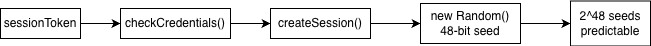

# Primary Vulnerability: Predictable Session Token

- The app uses `java.util.Random` in `Login.generateSessionToken()` to create a **security-sensitive session token**.
- This token is stored as `sessionToken` in `SessionPrefs` after successful authentication.
- Because `java.util.Random` is **not cryptographically secure**, the authentication state becomes predictable in principle.
- Session tokens must be **unpredictable**; otherwise an attacker may be able to **forge authenticated sessions**.
- Key code points: `KEY_SESSION_TOKEN`, `checkCredentials()`, `createSession()`, `generateSessionToken()`.

# PoC and Evidence Chain

- `checkCredentials()` validates the username and password.
- On success, the app calls `createSession()`.
- `createSession()` stores the generated value under `sessionToken`.
- `generateSessionToken()` uses `new Random()` with `nextInt(62)` over 16 characters.
- Therefore, a security-sensitive session token is generated by a predictable PRNG.

{ width=68% }

# Security Impact and Remediation

- **Impact:** predictable session token generation, possible session forgery / session hijacking risk, weakened authentication integrity.
- **CWE alignment:** **CWE-338 – Use of Cryptographically Weak Pseudo-Random Number Generator**.
- **Quantitative reasoning:** `java.util.Random` has a 48-bit internal state, while `SecureRandom` provides 128-bit+ entropy.
- **Fix:** replace `new Random()` with `new SecureRandom()`.
- **Supporting improvement:** avoid plaintext credential storage and use secure local storage.

| Property | Vulnerable design | Fixed design |
|---|---|---|
| RNG | `java.util.Random` | `SecureRandom` |
| Internal state / entropy | 48-bit | 128-bit+ |
| Security suitability | Predictable | Cryptographically secure |
| Attack practicality | Feasible in principle | Computationally infeasible |
